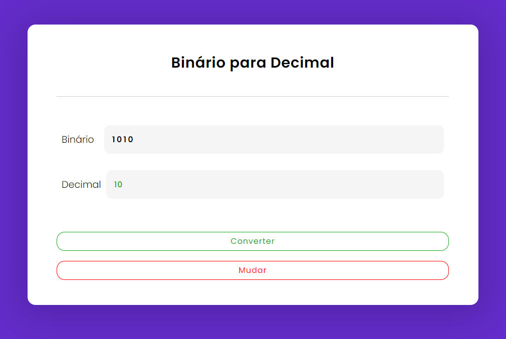

# Convertor-of-binary
A responsive conversor of binary to decimal 

All this coded by me!

# Technologies
In this project I used HTML5, CSS3 and JavaScript

## Result

> ### See and interact with the application [here](https://binary-to-decimal-lusk1nha.vercel.app/) 

